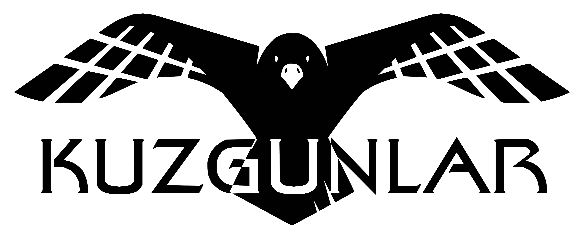

</img> 

# Kuzgunlar Model Verisetleri

Bu bölümde https://huggingface.co/kuzgunlar da bulunan ELECTRA modellerinin fine-tune edildiği verisetleri bulunmaktadır.

## NER
  NER [modelinin](https://huggingface.co/kuzgunlar/electra-turkish-ner) veriseti
  
  Sahin, H. Bahadir; Eren, Mustafa Tolga; Tirkaz, Caglar; Sonmez, Ozan; Yildiz, Eray (2017), “English/Turkish Wikipedia Named-Entity Recognition and Text Categorization Dataset”, Mendeley Data, v1 http://dx.doi.org/10.17632/cdcztymf4k.1
  
  verisetinin sınıflarının özel olarak 48 sınıfa indirilmesi ile oluşturulmuştur. Daha sonra Electra fine-tune için formatı değiştirilmiştir.

## Question Answer
  Question Answer [modelinin](https://huggingface.co/kuzgunlar/electra-turkish-qa) veriseti.
  
  Bir başka açık kaynak Türkçe soru-cevap veriseti olan [TQUAD](https://github.com/TQuad/turkish-nlp-qa-dataset) ile birlikte kullanılmak üzere wikipedia içerikleri kullanılarak hazırlandı.

## Sentence
  Masked LM uygulamaları için ~251 GB çevrimiçi Türkçe pdf verilerinin işlenmesiyle oluşturulmuş cümle verisetidir. Dosya boyutundan dolayı [Kaggle](https://www.kaggle.com/rootofarch/kuzgunlar-acikhack-tr-sentence) üzerinden paylaşılmıştır.
  
  [TurkishDeasciifier](https://github.com/StarlangSoftware/TurkishDeasciifier) kullanılarak Türkçe karakter hatalı yazılmış kelimeler aslına uygun olarak yeniden düzenlendi.
  
  [Zemberek](https://github.com/ahmetaa/zemberek-nlp) kullanılarak cümle içeriğindeki kelimelerin Türkçe oranı %80 ve üzeri olarak tanımlandı. Bu sayede gözden kaçan yabancı pdfler ve yabancı cümle alıntıları olabildiğince engellenilmeye çalışıldı.
